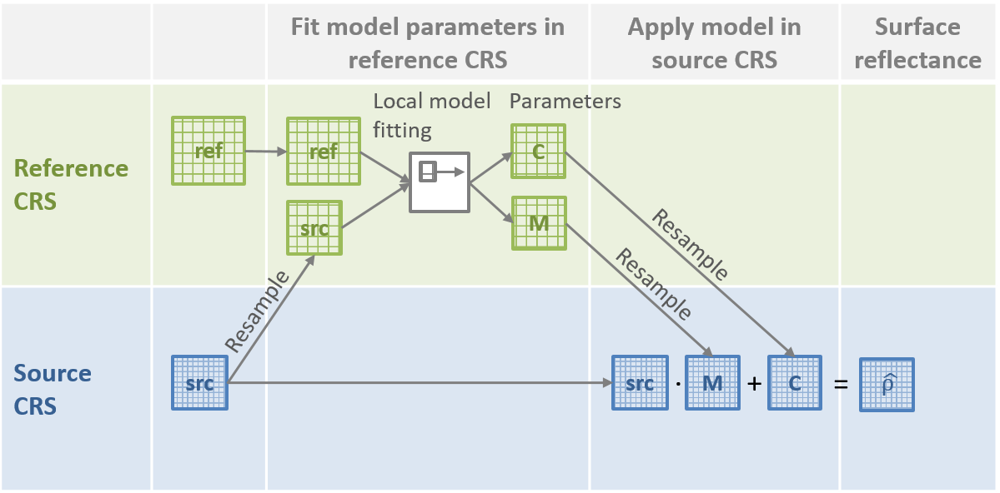
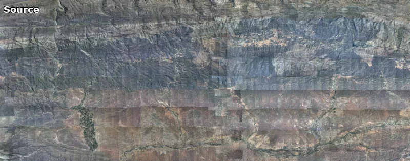
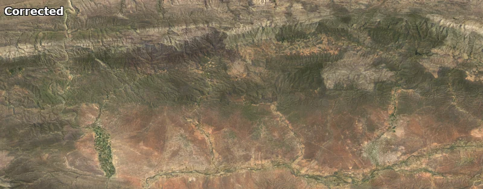

Correct imagery to surface reflectance
--------------------------------------

This method uses a fusion approach to correct imagery to approximate surface reflectance.  It requires a concurrent and co-located reference reflectance image with which to fuse the source.  Since the method's `initial conception <https://doi.org/10.1080/01431161.2018.1528404>`_ with my PhD supervisor, `Adriaan van Niekerk <https://www0.sun.ac.za/cga/adriaan-van-niekerk-director/>`_, it has evolved into the |homonim|_ package, and proved effective for a `range of imagery and problems <https://homonim.readthedocs.io/en/latest/case_studies.html>`_.

Spatially varying local linear models are used to approximate the relationship between source and reference images.  Images and model parameters are resampled or re-projected between the source and reference image CRS's (coordinate reference systems) to allow model estimation and application (as shown in the diagram).  Typically the reference has a lower resolution than the source image. Suitable sources of reference imagery are e.g. the `MODIS <https://developers.google.com/earth-engine/datasets/catalog/MODIS_061_MCD43A4>`_, `Landsat <https://developers.google.com/earth-engine/datasets/catalog/LANDSAT_LC08_C02_T1_L2>`_, or `Sentinel-2 <https://developers.google.com/earth-engine/datasets/catalog/COPERNICUS_S2_SR_HARMONIZED>`_ satellites.  The |geedim|_ companion tool was created for downloading these, and other satellite images.

|homonim|_ can help improve accuracy and stability of classification and regression applications, and is suited to the harmonisation of multi-sensor images.  It is available as a `python package <https://homonim.readthedocs.io/en/latest/installation.html>`_.  There are more details on its use and functioning in the `online documentation <https://homonim.readthedocs.io/en/latest/index.html>`_.

Example
^^^^^^^

A mosaic of NGI_ aerial imagery before and after correction with |homonim|_.

.. |geedim| replace:: ``geedim``
.. _geedim: https://github.com/dugalh/geedim
.. |homonim| replace:: ``homonim``
.. _homonim: https://github.com/dugalh/homonim
.. _NGI: https://ngi.dalrrd.gov.za/index.php/what-we-do/aerial-photography-and-imagery

