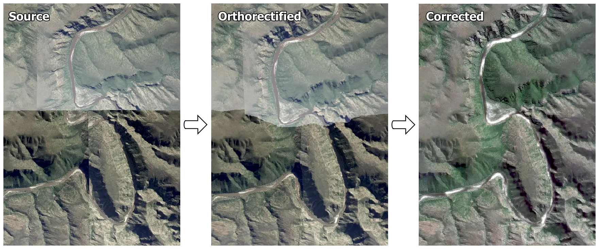

Orthorectification of aerial images
-----------------------------------

|simple-ortho|_ `orthorectifies <https://trac.osgeo.org/ossim/wiki/orthorectification>`_ aerial, and other imagery with known `pinhole camera model <https://en.wikipedia.org/wiki/Pinhole_camera_model>`_, and DEM (digital elevation model).  It works well with NGI_ aerial imagery, and together with |homonim|_ provides an open source processing chain for converting these valuable data into "science ready" surface reflectance imagery.  Currently, |simple-ortho|_ is available as a python library and command line tool via `GitHub <https://github.com/dugalh/simple-ortho>`_.  It makes use of the `OpenCV <https://opencv.org/>`_ and `rasterio <https://github.com/rasterio/rasterio>`_ packages for efficient reading, processing and writing of images.

Example
^^^^^^^

A mosaic of four NGI_ aerial images captured over the Kouga river in the Baviaanskloof, South Africa: in raw form (*Source*), orthorectified with |simple-ortho|_ (*Orthorectified*), and corrected to surface reflectance with |homonim|_ (*Corrected*).

.. |homonim| replace:: ``homonim``
.. _homonim: https://github.com/dugalh/homonim
.. |simple-ortho| replace:: ``simple-ortho``
.. _simple-ortho: https://github.com/dugalh/simple-ortho
.. _NGI: https://ngi.dalrrd.gov.za/index.php/what-we-do/aerial-photography-and-imagery

