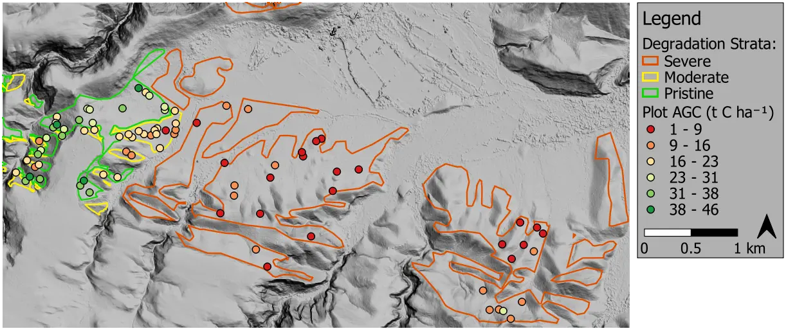

Farm-scale aboveground carbon mapping in thicket
------------------------------------------------

Large portions of the semi-arid thicket biome (South Africa) have been degraded, mostly by poorly managed goat-farming.  Restoration work and research is ongoing, and much needed for improving ecosystem function and mitigating climate change.  Aboveground carbon (AGC) maps are important tools required for restoration monitoring and funding.  As part of the `GEF-5 SLM (sustainable land management) project <https://www.thegef.org/projects-operations/projects/5327>`_, this work developed an AGC mapping approach for a ±3000 ha study area in the Baviaanskloof.

Using `species-specific allometric equations <https://doi.org/10.1016/j.foreco.2019.05.048>`_, AGC ground truth for 85 study area plots was produced from `field sampling data gathered by Sustainable Landscape Solutions <https://github.com/dugalh/map_thicket_agc/blob/main/docs/gef5_slm_final_report_c_baselines_may2020.pdf>`_.  Spatial accuracy of ground truth and remotely sensed imagery was emphasised to ensure the accurate location of field plot data in images.  Ground truth plots are shown on a DSM (digital surface model) derived from multi-view NGI_ imagery, below.

.. _gef5_slm_study_area:

Various AGC estimation approaches were evaluated using the ground truth.  These included the use of remotely sensed plant volume found from NGI image-derived `DTM and DSM <https://en.wikipedia.org/wiki/Digital_elevation_model#Terminology>`_ surfaces, and features extracted from multispectral imagery.  A multivariate linear regression model using features extracted from a multispectral `WorldView-3 <https://en.wikipedia.org/wiki/WorldView-3>`_ image was the best performing method.  Univariate linear models based on WorldView-3 and multispectral NGI images also performed well.  In the context of the need for cost-effective biome-wide AGC maps at repeated intervals, the use of multi-spectral satellite imagery was favoured as the approach most likely to scale to these requirements.

While thicket allometric models for AGC are complex at the plant-scale, the success of linear models in this study suggests the relationship between remotely sensed variables and thicket AGC may be relatively simple at a landscape-scale.  The `code repository  <https://github.com/dugalh/map_thicket_agc>`_, `related paper <https://doi.org/10.1117/1.JRS.15.038502>`_, and `project report <https://github.com/dugalh/map_thicket_agc/blob/main/docs/gef5_slm_remote_sensing_of_agc_in_thicket_nov2019.pdf>`_ contain more details on the imagery, method and performance.

.. _NGI: https://ngi.dalrrd.gov.za/index.php/what-we-do/aerial-photography-and-imagery
