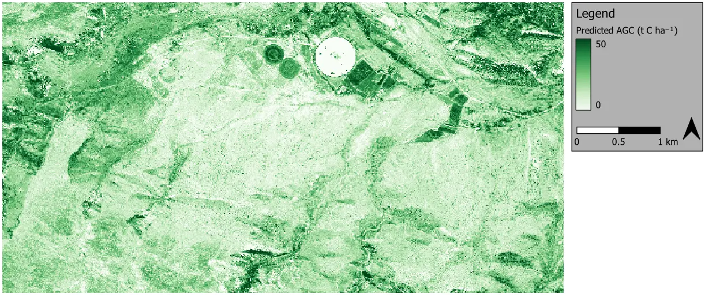

Farm-scale aboveground carbon mapping in thicket
------------------------------------------------

Large portions of the semi-arid thicket biome (South Africa) have been degraded, mostly by poorly managed goat-farming.  Restoration work and research is ongoing, and much needed for improving ecosystem function and mitigating climate change.  Aboveground carbon (AGC) maps are important tools required for restoration monitoring and funding.  As part of the `GEF-5 SLM (sustainable land management) project <https://www.thegef.org/projects-operations/projects/5327>`_, this work developed an AGC mapping approach for a 3000 ha study area in the Baviaanskloof.

Using `species-specific allometric equations <https://doi.org/10.1016/j.foreco.2019.05.048>`_, AGC ground truth for 85 plots was produced from field sampling data gathered by :abbr:`Sustainable Landscape Solutions (Cosman Bolus, Sustainable Landscape Solutions, cosbolus@gmail.com)`.  This ground truth was used to fit a regression model to features derived from `WorldView-3 <https://en.wikipedia.org/wiki/WorldView-3>`_ multi-spectral imagery.  Ground truth plots are shown on WorldView-3 image, in a colour-infrared rendering, below.

.. figure:: ../_images/thicket_agc-ground_truth_map.webp
    :align: center
    :class: dark-light

Of the tested regression approaches, a multivariate linear regression model with stepwise selected features performed best.  This straightforward approach produced an *R*\ :sup:`2` (coefficient of determination) of 0.89 and *RMSE* (root mean square error) of 2.86 t C ha\ :sup:`-1`.  Part of the success of the method can be attributed to the emphasis placed on quality of the AGC ground truth and spatial accuracy of both images and ground truth.  The regression model produced AGC map for the study area is shown below.

For more details, see the `code repository  <https://github.com/dugalh/map_thicket_agc>`_, as well as the the `related paper <https://doi.org/10.1117/1.JRS.15.038502>`_, and `project report <https://github.com/dugalh/map_thicket_agc/blob/main/docs/gef5_slm_remote_sensing_of_agc_in_thicket_nov2019.pdf>`_.
