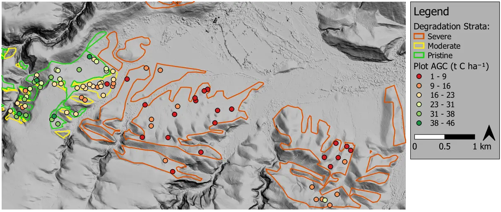

Farm-scale aboveground carbon mapping in thicket
------------------------------------------------

Large portions of the semi-arid thicket biome (South Africa) have been degraded, mostly by poorly managed goat-farming.  Restoration work and research is ongoing, and much needed for improving ecosystem function and mitigating climate change.  Aboveground carbon (AGC) maps are important tools required for restoration monitoring and funding.  As part of the `GEF-5 SLM (sustainable land management) project <https://www.thegef.org/projects-operations/projects/5327>`_, this work developed an AGC mapping approach for a ±3000 ha study area in the Baviaanskloof.

Using `species-specific allometric equations <https://doi.org/10.1016/j.foreco.2019.05.048>`_, AGC ground truth for 85 plots was produced from field sampling data gathered by :abbr:`Sustainable Landscape Solutions (Cosman Bolus, Sustainable Landscape Solutions, cosbolus@gmail.com)`.   Ground truth plots are shown on a DSM (digital surface model) derived from multi-view NGI_ imagery, below.

Various AGC estimation approaches were evaluated using the ground truth.  These included the use of remotely sensed plant volume found from NGI image-derived `DTM and DSM <https://en.wikipedia.org/wiki/Digital_elevation_model#Terminology>`_ surfaces (where the DTM was found by interpolating bare earth classified areas).  A regression model using features extracted from multi-spectral imagery outperformed this, and other methods.  In the context of the need for cost-effective biome-wide AGC maps at repeated intervals, the use of multi-spectral satellite imagery was also favoured as being the approach most likely to scale to these requirements.

Of the tested multi-spectral regression methods, a multivariate linear regression model with features selected from a `WorldView-3 <https://en.wikipedia.org/wiki/WorldView-3>`_ image performed best, providing operationally useful accuracies.  Univariate linear models based on WorldView-3 and NGI images also performed well.  While thicket allometric models for AGC are complex at a plant-scale, results of this study suggest the relationship between remotely sensed variables and thicket AGC may be relatively simple at a landscape-scale.  For more details on the method and results, see the `code repository  <https://github.com/dugalh/map_thicket_agc>`_, `related paper <https://doi.org/10.1117/1.JRS.15.038502>`_, and `project report <https://github.com/dugalh/map_thicket_agc/blob/main/docs/gef5_slm_remote_sensing_of_agc_in_thicket_nov2019.pdf>`_.

Of the tested multi-spectral regression approaches, a multivariate linear regression model with stepwise selected features, using a `WorldView-3 <https://en.wikipedia.org/wiki/WorldView-3>`_ image, performed best.  This straightforward approach produced an *R*\ :sup:`2` (coefficient of determination) of 0.89 and *RMSE* (root mean square error) of 2.86 t C ha\ :sup:`-1`.  Univariate linear regression models also performed well, with *R*\ :sup:`2` / *RMSE* scores of 0.85 / 3.28 t C ha\ :sup:`-1` for the WorldView-3 image and 0.82 / 3.49 t C ha\ :sup:`-1` for NGI imagery.  While thicket allometric models for AGC are complex at a plant-scale, these results suggest that the relationship between remotely sensed variables and thicket AGC at a may be relatively simple at a landscape-scale.

Multivariate WorldView-3 model AGC estimates are shown below.  For more details on the method and results, see the `code repository  <https://github.com/dugalh/map_thicket_agc>`_, as well as the the `related paper <https://doi.org/10.1117/1.JRS.15.038502>`_, and `project report <https://github.com/dugalh/map_thicket_agc/blob/main/docs/gef5_slm_remote_sensing_of_agc_in_thicket_nov2019.pdf>`_.

Scatter plots of measured (ground truth) versus predicted AGC are shown below for the (a) univariate, and (b) multivariate WorldView-3 models.

.. figure:: ../_images/thicket_agc-scatter_plot.webp
    :align: left
    :class: dark-light

The success of fairly basic models in this study may seem anomalous given the growing uptake of sophisticated machine learning techniques.  Nevertheless, results compare well with similar studies, and simple models have the advantage of being easier to extend, both spatially and over time.

Part of the success of this study can be attributed to the emphasis placed on quality of the AGC ground truth and spatial accuracy of both images and ground truth.

and was judged to be the most scalable, in terms of being able to offer cost-effective biome-wide AGC maps at repeated intervals.  of the thi.  This approach also offers the best potential for scaling up to the biome in a repeatable and cost-effective , both spatially, and multi-spectral features derived from satellite imagery.  Plant volume was approximated as the difference between `DTM and DSM <https://en.wikipedia.org/wiki/Digital_elevation_model#Terminology>`_ surfaces derived from multi-view NGI_ aerial imagery (e.g. DSM scene shown below), where the DTM was found by interpolating DSM bare earth areas, as identified by supervised classification on multi-spectral NGI_ images.  While the plant volume approach has advantages in terms  Given difficulties with scaling the plant volume approach to the biome, and its reliance on a high proportion of bare earth to reliably find the DTM, it

Various AGC estimation approaches were evaluated using the ground truth, including the use of DSM - DTM difference derived plant volume, where DSM found from mu

.. figure:: ../_images/thicket_agc-3d_scene.webp
    :align: center
    :class: dark-light
    :height: 350

found by differencing `DSM and DTM <https://en.wikipedia.org/wiki/Digital_elevation_model#Terminology>`_ models that were derived from multi-view NGI_ aerial imagery.  Of the tested methods a regression model built on features derived , and a vegetation canopy cover feature derived from supervised classification on multi-spectral.

Various AGC estimation methods were evaluated using the ground truth:

* Approximate plant volume feature found by differencing `DSM and DTM <https://en.wikipedia.org/wiki/Digital_elevation_model#Terminology>`_ models derived from multi-view NGI_ aerial imagery.

A plant volume feature, found by differencing DSM and DTM (digital terrain) models derived from multi-view NGI_ aerial imagery.  , including a regression model built with a plant volume feature that was found with DSM and DTM models derived from multi-view NGI_ aerial imagery.   using This ground truth was used to fit a regression model to features derived from `WorldView-3 <https://en.wikipedia.org/wiki/WorldView-3>`_ multi-spectral imagery.

.. figure:: ../_images/thicket_agc-scatter_plot.webp
    :align: left
    :class: dark-light
    :height: 300

Of the tested regression approaches, a multivariate linear regression model with stepwise selected features performed best.  This straightforward approach produced an *R*\ :sup:`2` (coefficient of determination) of 0.89 and *RMSE* (root mean square error) of 2.86 t C ha\ :sup:`-1`.  Part of the success of the method can be attributed to the emphasis placed on quality of the AGC ground truth and spatial accuracy of both images and ground truth.

.. figure:: ../_images/thicket_agc-agc_map.webp
    :align: center
    :class: dark-light

To do
Mention volume dsm-dtm approach, underperformed ms regression, and .  Mention the importance to create biome-wide approach, scalability and cost.  Various approaches were evaluated, including a volume based approach based on the subtraction of DTM and DSM derived from multi-view NGI aerial imagery (see below).  Taking accuracy, scalability and cost into account, the direct ms regression was decided on as the approach with the strongest potential for creating a robust, cost-effective, biome-wide AGC method that can facilitate broad uptake of restoration.

Also speak about simplicity of the model is surprising? even uni-variate model performs well suggests rel can be simple at a landscape scale.  counter-cultural, but advantageous for extending spatially and temporally.

.. _NGI: https://ngi.dalrrd.gov.za
